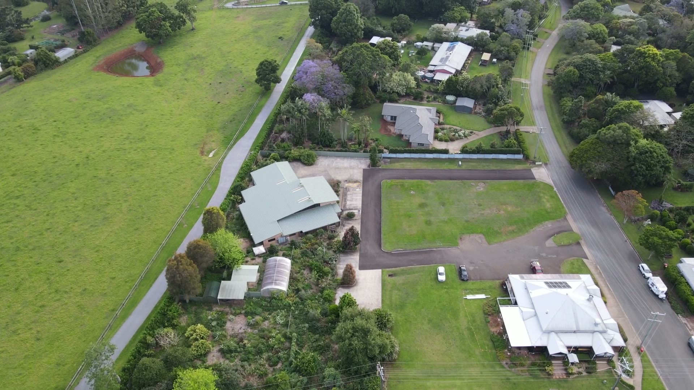
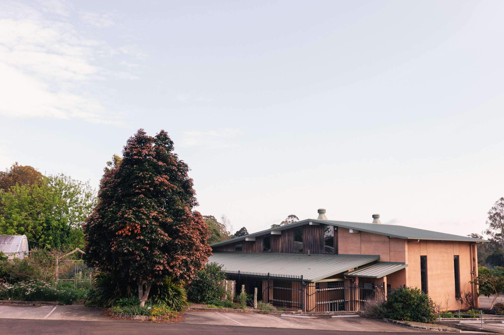
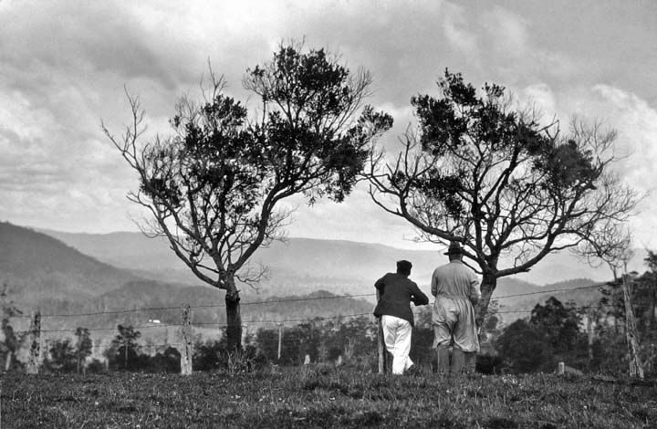
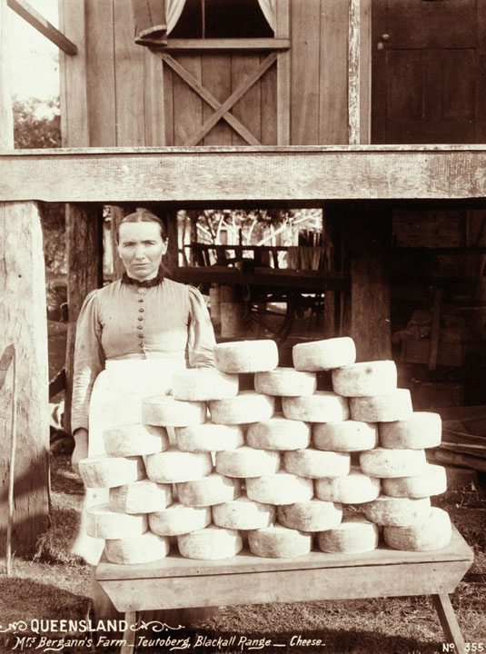
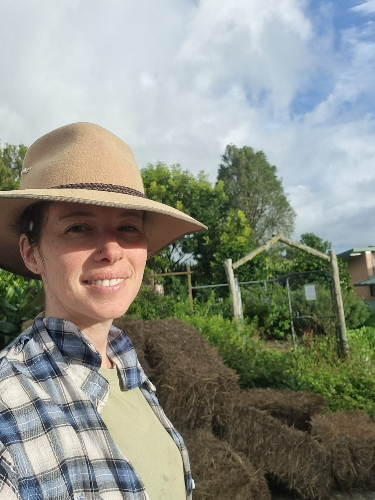
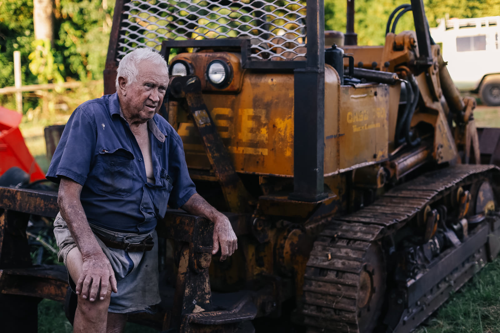
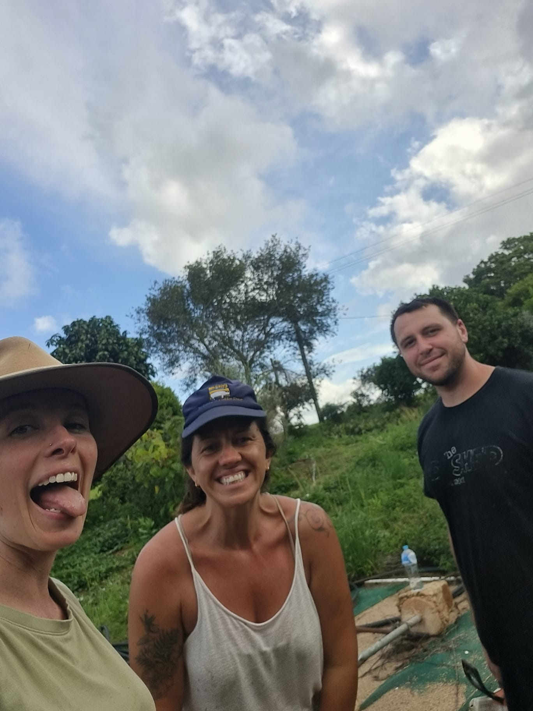

<!-- _class: lead -->

# The Harvest

## Garden. Kitchen. Art Space.

A working place taking shape in Witta, on Jinibara Country.

---

# The simple idea

The Harvest is not trying to be everything.

It is three public rooms:

**Garden** to grow from.

**Kitchen** to feed from.

**Art Space** to make in.

---

# Why Witta

Witta has people, stories, skills, produce, old sheds, and practical generosity.

It needs a room where those things can meet.

The Harvest starts there.

---

# First residency

## Timber. Dairy. Co-operatives.

Old timber.

Milk crates.

Round tables.

Shared tools.

The first build should carry the memory of the industries that helped hold this district.

---

# What opens first

**The Garden**

Paths, beds, nursery life, working bees, food in the ground.

**The Kitchen**

Simple food, milk bar thinking, pop-ups, a long table.

**The Art Space**

Workshops, tools, walls that can change, first makers in the room.

---

# What people see

A gate that is open.

A shed waking up.

A milk crate pavilion being built.

A garden that already has life in it.

A table that does not need to be perfect.

---

# What we need

Hands.

Old timber.

Milk crates.

Local stories.

Garden knowledge.

Kitchen knowledge.

People who want to build the first version before it is polished.

---

# The launch test

By 20 June 2026, the brand and site need to answer five questions:

1. What is The Harvest?
2. Where is it?
3. What can I do there first?
4. How do I help?
5. Why does this feel like Witta?

---

# The website job

The first screen should make the place legible.

No generic launch copy.

No vague community words.

No pretending the venue is finished.

Show the rooms.

Show the material.

Show the next invitation.

---

<!-- _class: lead -->

# Come see what is taking shape.

The Harvest, Witta. Launch readiness target: 20 June 2026.

---

# Source rule

This deck uses real Harvest photos, real website screenshots, floor plans, and historical Witta images.

Before public use, each image needs:

source, rights, consent, attribution, and story note.
