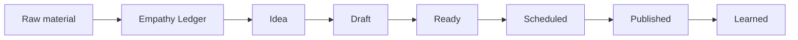

# Content Flow and Stages

## Pipeline

## Raw Material

Raw material can be:

- phone photo
- drone photo
- video set
- finished graphic
- event detail
- quote from a local
- story from the site
- question people keep asking
- progress update
- call for volunteers, makers, growers, artists, or food people

Add the raw material to Empathy Ledger first.

Use the Harvest gallery and tag the asset before it becomes a post idea:

| Story type | Work tag | Theme tags | Category |
| --- | --- | --- | --- |
| Milk crate pavilion | `milk-crate-pavilion` | `make`, `gather` | `milestone` or `during` |
| Sophie / garden story | `the-garden` | `grow`, `gather` | `during` |
| Drone site progress | `milk-crate-pavilion` or `general-harvest` | `make`, `gather` | `milestone` |
| WhatsApp garden crew | `the-garden` | `grow` | `during` |
| Human detail / working bee | relevant work | `gather` plus the work theme | `during` |

Only after the asset is in Empathy Ledger should it move into Obsidian planning, GHL drafts, or Notion records.

## Notion Statuses

| Status | Meaning | Required before moving on |
| --- | --- | --- |
| Idea | Useful but unshaped | One sentence describing the point |
| Draft | Copy or asset is being made | Working caption or newsletter block |
| Ready | Approved for publishing | Copy, asset, account, link, date |
| Scheduled | In GHL or manually scheduled | GHL post ID or manual note |
| Published | Live | Published link or confirmation |
| Learned | Reviewed after publishing | Comment, reply, click, signup, or lesson |

## Fields To Fill In Notion

Required:
- `Content/Communication Name`
- `Project`
- `Communication Type`
- `Status`
- `Sent date`
- `Target Accounts`
- `Key Message/Story`

Recommended:
- `Image`
- `Video link`
- `Link`
- `UTM Content`
- `Notes`
- `GHL Post ID`

## Communication Types

Use these consistently:

- Instagram
- Facebook
- Newsletter
- LinkedIn Post

If a piece is for both Instagram and Facebook, create one row and use `Target Accounts` to select both. If the copy needs to be meaningfully different, create two rows.

## Approval Rules

Ready means:

- the first line is strong enough to stop a scroll
- the photo or graphic is selected
- the link is correct
- the audience is clear
- no private or sensitive details are exposed
- cultural or community protocol has been considered where relevant

## GHL Handoff

Social:
- EL-selected assets and Obsidian copy become GHL Social Planner drafts.
- After publishing or scheduling, write the GHL post ID back into Notion.
- Status becomes `Scheduled`.

Newsletter:
- Write from the weekly Obsidian plan and selected Empathy Ledger assets.
- Assemble in the GHL HTML template.
- Send a test to Ben and Nic.
- Send only to the correct Harvest segment.
